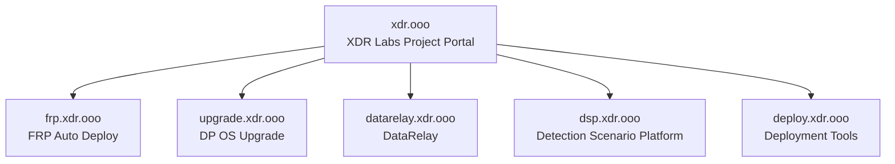

# XDR Labs

**Open-source and field-built tools for security engineering, deployment, remote access, and detection validation.**

XDR Labs is a central home for practical engineering projects built to remove repetitive infrastructure and security-operations work. Each project is maintained independently with its own documentation, release lifecycle, and source repository.

<Note>
  This site is a project portal, not a monolithic product manual. Select a project below to open its dedicated documentation or repository.
</Note>

## Projects

<CardGroup cols={2}>
  <Card title="FRP Auto Deploy" icon="network-wired" href="https://frp.xdr.ooo">
    Lightweight Zero-Touch remote access for systems behind NAT and firewalls. Secure enrollment, persistent identity, service publishing, and `frpctl` operations.
  </Card>

  <Card title="DP OS Upgrade" icon="arrow-up-from-bracket" href="https://github.com/xdr-labs/xdr-labs-dp-os-upgrade-docs">
    Documentation and tooling for controlled DP operating-system upgrade workflows. Dedicated documentation portal migration is in progress.
  </Card>

  <Card title="Detection Scenario Platform" icon="radar" href="https://github.com/xdr-labs/xdr-poc-script">
    Real traffic and detection-scenario generation for validating XDR detections in POC and lab environments.
  </Card>

  <Card title="DataRelay" icon="arrows-left-right">
    Data relay and integration project. Dedicated documentation portal will be linked here as it is migrated.
  </Card>

  <Card title="Deployment Tools" icon="server">
    Deployment automation for DP, Sensor, AIO, and related virtualized environments. Documentation portal will be linked here as it is migrated.
  </Card>
</CardGroup>

## How the portal is organized

The dedicated hostnames above are the intended long-term structure. Only portals that are already deployed should be treated as live endpoints; others will be linked here as migration is completed.

## Design principles

<CardGroup cols={2}>
  <Card title="Independent projects" icon="boxes-stacked">
    Each project keeps its own repository, documentation, release cycle, and support boundaries.
  </Card>

  <Card title="One place to discover them" icon="compass">
    `xdr.ooo` provides a stable entry point so users do not need to remember every project hostname.
  </Card>

  <Card title="Documentation first" icon="book-open">
    Project pages focus on installation, usage, architecture, troubleshooting, and operational limits.
  </Card>

  <Card title="Practical scope" icon="wrench">
    Projects are designed around real field problems rather than expanding into unnecessary platform complexity.
  </Card>
</CardGroup>

## Current live documentation

### FRP Auto Deploy

The first fully migrated project documentation is **FRP Auto Deploy**.

<CardGroup cols={2}>
  <Card title="Open Documentation" icon="book" href="https://frp.xdr.ooo">
    Product overview, OCI reference deployment, Quick Start, services, `frpctl`, deployment modes, operations, security, and troubleshooting.
  </Card>

  <Card title="Source Repository" icon="github" href="https://github.com/datarelay-labs/frp-auto-deploy">
    View the FRP Auto Deploy source project and releases.
  </Card>
</CardGroup>

## More projects are being migrated

The portal will gradually replace scattered project landing pages with consistent project documentation under dedicated `*.xdr.ooo` hostnames.
