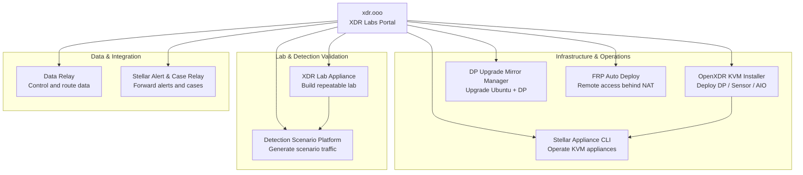

# XDR Labs

**Practical tools for security engineering, infrastructure deployment, remote access, platform upgrades, data delivery, and detection validation.**

XDR Labs brings together independent projects created to remove repetitive field work. Each project keeps its own source repository, release lifecycle, documentation, and support boundary; this site is the common place to discover them.

<Note>
  Start with the problem you want to solve. You do not need to understand the entire project family before using one tool.
</Note>

## Choose by problem

<CardGroup cols={2}>
  <Card title="I need remote access behind NAT/firewalls" icon="network-wired" href="https://frp.xdr.ooo">
    **FRP Auto Deploy** — Zero-Touch remote access with secure enrollment, persistent identity, service publishing, and `frpctl` operations.
  </Card>

  <Card title="I need to upgrade a Stellar DP to Ubuntu 24.04" icon="arrow-up-from-bracket" href="https://dpos.xdr.ooo/">
    **DP Ubuntu Upgrade Mirror Manager** — prepare a local mirror and run controlled Ubuntu 16.04 → 24.04 plus DP 6.6.0 Phase 2 workflows.
  </Card>

  <Card title="I need to deploy DP / Sensor on KVM" icon="server" href="https://github.com/xdr-labs/OpenXDR-KVM-Installer">
    **OpenXDR KVM Installer** — automated KVM deployment for Data Processor, Sensor, and AIO + Sensor environments.
  </Card>

  <Card title="I need a repeatable XDR / NDR lab" icon="flask" href="https://github.com/xdr-labs/xdr-lab-appliance">
    **XDR Lab Appliance** — a rebuildable KVM + Open vSwitch lab with Sensor, Linux/Windows targets, traffic mirroring, and external access.
  </Card>

  <Card title="I need realistic detection-validation traffic" icon="radar" href="https://github.com/xdr-labs/xdr-poc-script">
    **Detection Scenario Platform (DSP)** — generate realistic security-scenario traffic and produce structured evidence and reports for lab/XDR validation.
  </Card>

  <Card title="I need Stellar alerts and cases in my existing SIEM/SOC" icon="arrow-right-arrow-left" href="https://stellar-relay.xdr.ooo">
    **Stellar Alert & Case Relay** — retrieve Stellar Cyber alerts and cases through the API and forward them into existing SIEM/SOC workflows as TCP NDJSON, with independent streams and operational recovery features.
  </Card>

  <Card title="I need to control and route enterprise data" icon="arrows-left-right" href="https://github.com/datarelay-labs/gdc-platform">
    **Data Relay** — an open-source enterprise data control gateway for collection, transformation, protection, governance, and multi-destination delivery.
  </Card>
</CardGroup>

## Projects

### Core projects

<CardGroup cols={2}>
  <Card title="FRP Auto Deploy" icon="network-wired" href="https://frp.xdr.ooo">
    Lightweight deployment and operations layer over official FRP. It lets remote Linux systems behind NAT/firewalls establish outbound tunnels, then exposes SSH, HTTP, HTTPS, or custom TCP services through persistent public ports.

    **Documentation:** `frp.xdr.ooo`  
    **Source:** `datarelay-labs/frp-auto-deploy`
  </Card>

  <Card title="DP Ubuntu Upgrade Mirror Manager" icon="arrow-up-from-bracket" href="https://dpos.xdr.ooo/">
    Prepares one Ubuntu 24.04 mirror server and uses it to drive controlled Stellar Cyber DP upgrades from Ubuntu 16.04 through 24.04, followed by DP 6.6.0 Phase 2 bringup. DP hosts can work from the local HTTP mirror without direct access to the external artifact sources.

    **Documentation:** `dpos.xdr.ooo`  
    **Source:** `xdr-labs/ubuntu-mirror-automation`
  </Card>

  <Card title="Data Relay" icon="arrows-left-right" href="https://github.com/datarelay-labs/gdc-platform">
    Open-source Enterprise Data Control Gateway. It collects data from APIs, webhooks, and supported databases; applies mapping, enrichment, schema/sensitive-data controls and policy; then delivers to multiple destinations with governance, RBAC, audit, quarantine, and replay.

    **Source:** `datarelay-labs/gdc-platform`
  </Card>

  <Card title="Detection Scenario Platform (DSP)" icon="radar" href="https://github.com/xdr-labs/xdr-poc-script">
    Operational security-scenario runner for realistic traffic generation. It supports scenario execution, traffic profiles, structured Event Store evidence, reports, and local or remote execution paths for lab and XDR validation.

    **Source:** `xdr-labs/xdr-poc-script`
  </Card>
</CardGroup>

### Deployment & appliance operations

<CardGroup cols={2}>
  <Card title="OpenXDR KVM Installer" icon="server" href="https://github.com/xdr-labs/OpenXDR-KVM-Installer">
    Automates KVM host preparation and VM deployment for Stellar Cyber Data Processor, Sensor, high-performance Sensor, and AIO + Sensor configurations. It covers hardware detection, networking, KVM/libvirt, storage, SR-IOV/PCI passthrough, and VM deployment workflows.
  </Card>

  <Card title="Stellar Appliance CLI" icon="terminal" href="https://github.com/xdr-labs/Stellar-appliance-cli">
    Unified `aella_cli` interface for KVM hosts created by the deployment tooling. It manages network settings, DNS/NTP, ACLs, host information, services, VM console/autostart, and related appliance operations.
  </Card>
</CardGroup>

### Lab & integration utilities

<CardGroup cols={2}>
  <Card title="XDR Lab Appliance" icon="flask" href="https://github.com/xdr-labs/xdr-lab-appliance">
    Self-contained XDR/NDR lab built on Ubuntu 24.04, KVM, and Open vSwitch. It orchestrates a Stellar Sensor plus Linux and Windows test targets, traffic mirroring, deterministic reverse-NAT access, and rebuildable lab state.
  </Card>

  <Card title="Stellar Alert & Case Relay" icon="arrow-right-arrow-left" href="https://stellar-relay.xdr.ooo">
    Lightweight Python relay for organizations that want Stellar Cyber alerts and cases delivered into an existing SIEM or SOC portal. It polls the Stellar Cyber API and forwards newline-delimited JSON over TCP, supports alert-only, case-only, or combined operation, and includes checkpoint, retry/recovery, backfill, and separate destinations.

    **Documentation:** `stellar-relay.xdr.ooo`  
    **Source:** `xdr-labs/Stellar-Case-Alert-to-Sylog`
  </Card>
</CardGroup>

## How the projects fit together

This is a **toolbox, not a single bundled platform**. Projects can be used independently. The arrows only show common operational relationships.

## Project directory

| Project | Primary purpose | Documentation | Source |
| --- | --- | --- | --- |
| **FRP Auto Deploy** | Zero-Touch remote access behind NAT/firewalls | [frp.xdr.ooo](https://frp.xdr.ooo) | [GitHub](https://github.com/datarelay-labs/frp-auto-deploy) |
| **DP Ubuntu Upgrade Mirror Manager** | Controlled DP OS + Phase 2 upgrade workflow | [dpos.xdr.ooo](https://dpos.xdr.ooo/) | [GitHub](https://github.com/xdr-labs/ubuntu-mirror-automation) |
| **Data Relay** | Enterprise data control and multi-destination delivery | Project docs in repository | [GitHub](https://github.com/datarelay-labs/gdc-platform) |
| **Detection Scenario Platform** | Realistic security-scenario traffic and evidence | Project docs in repository | [GitHub](https://github.com/xdr-labs/xdr-poc-script) |
| **OpenXDR KVM Installer** | DP/Sensor/AIO deployment on KVM | Repository README | [GitHub](https://github.com/xdr-labs/OpenXDR-KVM-Installer) |
| **Stellar Appliance CLI** | KVM appliance operations | Repository README | [GitHub](https://github.com/xdr-labs/Stellar-appliance-cli) |
| **XDR Lab Appliance** | Rebuildable XDR/NDR lab | Repository docs | [GitHub](https://github.com/xdr-labs/xdr-lab-appliance) |
| **Stellar Alert & Case Relay** | Stellar alert/case forwarding into existing SIEM/SOC workflows | [stellar-relay.xdr.ooo](https://stellar-relay.xdr.ooo) | [GitHub](https://github.com/xdr-labs/Stellar-Case-Alert-to-Sylog) |

## Common design philosophy

<CardGroup cols={2}>
  <Card title="Solve field problems" icon="wrench">
    Projects start from recurring deployment, support, validation, and data-operation pain rather than feature-count goals.
  </Card>

  <Card title="Automate the repetitive parts" icon="gears">
    Installation, preparation, validation, state handling, and operator workflows are automated where that reduces error and support effort.
  </Card>

  <Card title="Keep projects independent" icon="boxes-stacked">
    A user can adopt one project without installing the rest. Repositories and release lifecycles remain separate.
  </Card>

  <Card title="Document the operational boundary" icon="book-open">
    Each project should explain prerequisites, responsibility boundaries, supported paths, failure handling, and recovery instead of hiding infrastructure assumptions.
  </Card>
</CardGroup>

## Source organizations

- [XDR Labs on GitHub](https://github.com/xdr-labs) — deployment, upgrade, lab, detection-validation, and integration utilities
- [DataRelay Labs on GitHub](https://github.com/datarelay-labs) — FRP Auto Deploy and Data Relay projects
