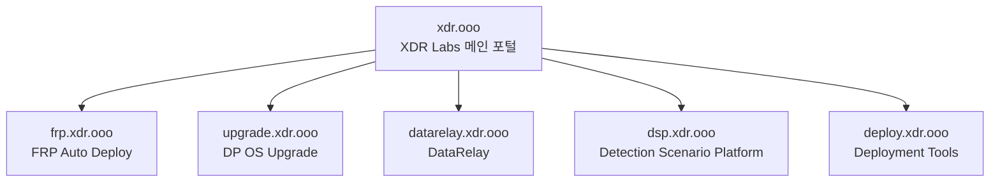

# XDR Labs

**보안 엔지니어링, 배포, 원격 접속, 탐지 검증을 위한 실전 프로젝트와 도구를 한곳에서 찾을 수 있는 통합 포털입니다.**

XDR Labs는 반복적이고 불편한 인프라/보안 운영 작업을 줄이기 위해 만든 프로젝트들을 모아두는 메인 사이트입니다. 각 프로젝트는 별도의 문서, 릴리스 주기, 소스 저장소를 독립적으로 유지합니다.

<Note>
  이 사이트는 하나의 제품 매뉴얼이 아니라 **프로젝트 디렉터리**입니다. 아래에서 원하는 프로젝트를 선택하면 해당 전용 문서나 저장소로 이동합니다.
</Note>

## 프로젝트

<CardGroup cols={2}>
  <Card title="FRP Auto Deploy" icon="network-wired" href="https://frp.xdr.ooo">
    NAT/방화벽 뒤 시스템을 위한 Lightweight Zero-Touch 원격 접속 도구. 안전한 등록, 영구 Identity, 서비스 공개, `frpctl` 운영을 제공합니다.
  </Card>

  <Card title="DP OS Upgrade" icon="arrow-up-from-bracket" href="https://github.com/xdr-labs/xdr-labs-dp-os-upgrade-docs">
    DP 운영체제를 안전하게 업그레이드하기 위한 자동화 도구와 문서입니다. 전용 문서 사이트로 마이그레이션 중입니다.
  </Card>

  <Card title="Detection Scenario Platform" icon="radar" href="https://github.com/xdr-labs/xdr-poc-script">
    POC/Lab 환경에서 XDR 탐지를 검증하기 위한 실제 트래픽 및 Detection Scenario 생성 프로젝트입니다.
  </Card>

  <Card title="DataRelay" icon="arrows-left-right">
    Data relay 및 integration 프로젝트입니다. 전용 문서 사이트 마이그레이션이 완료되면 여기에서 연결합니다.
  </Card>

  <Card title="Deployment Tools" icon="server">
    DP, Sensor, AIO 및 관련 가상화 환경의 배포 자동화 도구입니다. 전용 문서 사이트를 순차적으로 연결합니다.
  </Card>
</CardGroup>

## 전체 구조

위 전용 hostname은 장기적으로 사용할 구조입니다. 현재 실제 배포가 끝난 사이트만 live endpoint로 사용하고, 나머지는 마이그레이션이 완료될 때 이 포털에서 연결합니다.

## 운영 원칙

<CardGroup cols={2}>
  <Card title="프로젝트는 독립적으로" icon="boxes-stacked">
    각 프로젝트는 별도 GitHub 저장소, 문서, 릴리스 주기, 지원 범위를 유지합니다.
  </Card>

  <Card title="찾는 곳은 하나로" icon="compass">
    사용자는 모든 주소를 외울 필요 없이 `xdr.ooo`에서 원하는 프로젝트를 찾을 수 있습니다.
  </Card>

  <Card title="문서 중심" icon="book-open">
    설치, 사용법, 구조, 문제 해결, 지원 범위를 실제 사용자가 이해하기 쉽게 제공합니다.
  </Card>

  <Card title="실제 문제 중심" icon="wrench">
    프로젝트를 불필요하게 큰 플랫폼으로 확장하기보다 현장에서 반복되는 문제 해결에 집중합니다.
  </Card>
</CardGroup>

## 현재 Live 문서

### FRP Auto Deploy

현재 가장 먼저 Mintlify로 완전히 마이그레이션된 프로젝트입니다.

<CardGroup cols={2}>
  <Card title="문서 열기" icon="book" href="https://frp.xdr.ooo">
    제품 소개, OCI 무료티어 서버 준비, Quick Start, 서비스, `frpctl`, 배포, 운영, 보안, 문제 해결을 확인합니다.
  </Card>

  <Card title="소스 저장소" icon="github" href="https://github.com/datarelay-labs/frp-auto-deploy">
    FRP Auto Deploy 소스와 릴리스를 확인합니다.
  </Card>
</CardGroup>

## 앞으로의 마이그레이션

기존에 여러 곳에 흩어져 있는 프로젝트 소개/문서를 점차 전용 `*.xdr.ooo` 문서 사이트로 옮기고, 이 포털을 중앙 진입점으로 유지할 예정입니다.
