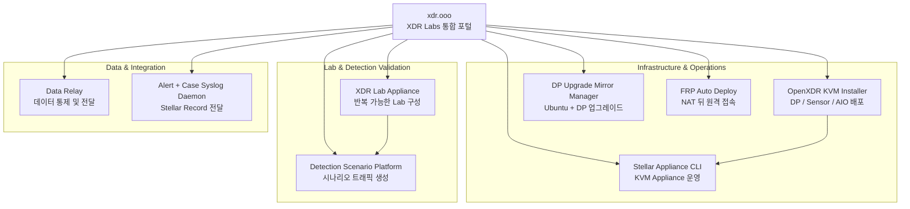

# XDR Labs

**보안 엔지니어링, 인프라 배포, 원격 접속, 플랫폼 업그레이드, 데이터 전달, 탐지 검증을 위한 실전 프로젝트를 한곳에서 찾는 통합 포털입니다.**

XDR Labs는 현장에서 반복되는 설치·운영·지원·검증 작업을 줄이기 위해 만든 독립 프로젝트들을 모아둔 중앙 진입점입니다. 각 프로젝트는 자신의 소스 저장소, 릴리스 주기, 문서와 지원 범위를 독립적으로 유지합니다.

<Note>
  모든 프로젝트를 먼저 이해할 필요는 없습니다. 지금 해결하려는 문제를 기준으로 프로젝트를 선택하세요.
</Note>

## 문제별로 선택하기

<CardGroup cols={2}>
  <Card title="NAT/방화벽 뒤 서버에 원격 접속하고 싶습니다" icon="network-wired" href="https://frp.xdr.ooo">
    **FRP Auto Deploy** — Zero-Touch 등록, 영구 Identity, 서비스 공개, `frpctl` 운영을 제공하는 경량 원격 접속 관리 도구입니다.
  </Card>

  <Card title="Stellar DP를 Ubuntu 24.04로 업그레이드해야 합니다" icon="arrow-up-from-bracket" href="https://dpos.xdr.ooo/">
    **DP Ubuntu Upgrade Mirror Manager** — 로컬 Mirror Server를 준비하고 Ubuntu 16.04 → 24.04 및 DP 6.6.0 Phase 2 절차를 제어합니다.
  </Card>

  <Card title="DP / Sensor를 KVM에 자동 배포하고 싶습니다" icon="server" href="https://github.com/xdr-labs/OpenXDR-KVM-Installer">
    **OpenXDR KVM Installer** — Data Processor, Sensor, AIO + Sensor 환경의 KVM 배포를 자동화합니다.
  </Card>

  <Card title="반복해서 재구축 가능한 XDR / NDR Lab이 필요합니다" icon="flask" href="https://github.com/xdr-labs/xdr-lab-appliance">
    **XDR Lab Appliance** — KVM + Open vSwitch 기반으로 Sensor, Linux/Windows target, traffic mirror, 외부 접속을 포함한 Lab을 구성합니다.
  </Card>

  <Card title="XDR 탐지 검증용 실제 트래픽을 만들고 싶습니다" icon="radar" href="https://github.com/xdr-labs/xdr-poc-script">
    **Detection Scenario Platform (DSP)** — 보안 시나리오 트래픽을 생성하고 Event Store 기반 evidence와 report를 만듭니다.
  </Card>

  <Card title="기업 데이터를 통제해서 여러 Destination으로 보내고 싶습니다" icon="arrows-left-right" href="https://github.com/datarelay-labs/gdc-platform">
    **Data Relay** — 수집, Mapping, Enrichment, 보호/정책, Governance, 다중 Destination 전달을 위한 오픈소스 Enterprise Data Control Gateway입니다.
  </Card>
</CardGroup>

## 프로젝트

### 핵심 프로젝트

<CardGroup cols={2}>
  <Card title="FRP Auto Deploy" icon="network-wired" href="https://frp.xdr.ooo">
    공식 FRP 위에 설치·등록·Identity·Service·Port·운영 기능을 추가하는 Lightweight Deployment & Operations Layer입니다. NAT/방화벽 뒤 Linux 시스템이 서버로 outbound tunnel을 만들고, SSH/HTTP/HTTPS/Custom TCP 서비스를 영구 public port로 공개할 수 있습니다.

    **문서:** `frp.xdr.ooo`  
    **소스:** `datarelay-labs/frp-auto-deploy`
  </Card>

  <Card title="DP Ubuntu Upgrade Mirror Manager" icon="arrow-up-from-bracket" href="https://dpos.xdr.ooo/">
    Ubuntu 24.04 Mirror Server 한 대를 준비하고 Stellar Cyber DP를 Ubuntu 16.04에서 18.04 → 20.04 → 22.04 → 24.04 순으로 업그레이드한 뒤 DP 6.6.0 Phase 2 bringup까지 수행하도록 구성된 도구입니다. DP는 외부 artifact source 대신 로컬 HTTP Mirror만 사용하도록 설계되어 있습니다.

    **문서:** `dpos.xdr.ooo`  
    **소스:** `xdr-labs/ubuntu-mirror-automation`
  </Card>

  <Card title="Data Relay" icon="arrows-left-right" href="https://github.com/datarelay-labs/gdc-platform">
    오픈소스 Enterprise Data Control Gateway입니다. HTTP API, Webhook, 지원되는 Database source에서 데이터를 수집하고 Mapping/Enrichment, Schema Drift, Sensitive Data Detection, Protection, Classification, Policy를 적용한 뒤 여러 Destination으로 전달합니다. Governance, RBAC, Audit, Quarantine, Replay도 제공합니다.

    **소스:** `datarelay-labs/gdc-platform`
  </Card>

  <Card title="Detection Scenario Platform (DSP)" icon="radar" href="https://github.com/xdr-labs/xdr-poc-script">
    Lab/XDR 검증을 위한 실전 Security Scenario Runner입니다. Port Sweep, DNS Tunnel, HTTP/SQLi/SSH 계열 등의 실제 트래픽을 실행하고 Event Store에 구조화된 이벤트를 기록하며 report와 evidence를 생성합니다. Local 또는 remote webshell 실행 경로를 지원합니다.

    **소스:** `xdr-labs/xdr-poc-script`
  </Card>
</CardGroup>

### 배포 & Appliance 운영

<CardGroup cols={2}>
  <Card title="OpenXDR KVM Installer" icon="server" href="https://github.com/xdr-labs/OpenXDR-KVM-Installer">
    Stellar Cyber Data Processor, Sensor, 고성능 Sensor, AIO + Sensor 구성을 KVM에 배포하기 위한 자동화 프로젝트입니다. Hardware/NIC 감지, Network 설정, KVM/libvirt, Storage, SR-IOV/PCI Passthrough, VM 배포 절차를 자동화합니다.
  </Card>

  <Card title="Stellar Appliance CLI" icon="terminal" href="https://github.com/xdr-labs/Stellar-appliance-cli">
    KVM Installer로 구축된 호스트를 운영하기 위한 통합 `aella_cli`입니다. Network, DNS/NTP, ACL, 시스템 정보, Service, VM Console/Autostart 등의 Appliance 운영 기능을 하나의 CLI로 제공합니다.
  </Card>
</CardGroup>

### Lab & Integration Utility

<CardGroup cols={2}>
  <Card title="XDR Lab Appliance" icon="flask" href="https://github.com/xdr-labs/xdr-lab-appliance">
    Ubuntu 24.04, KVM, Open vSwitch 기반의 self-contained XDR/NDR Lab입니다. Stellar Sensor, Linux/Windows victim, traffic mirror, deterministic reverse-NAT 외부 접속을 포함하고 Lab 전체를 다시 구축할 수 있도록 설계되어 있습니다.
  </Card>

  <Card title="Stellar Alert + Case Syslog Daemon" icon="arrow-right-arrow-left" href="https://github.com/xdr-labs/Stellar-Case-Alert-to-Sylog">
    Stellar Cyber API에서 Alert와 Case를 주기적으로 가져와 원격 collector에 TCP NDJSON 형태로 전달하는 장기 실행 Python daemon입니다. Alert/Case stream을 서로 독립적으로 활성화할 수 있습니다.
  </Card>
</CardGroup>

## 프로젝트 관계 한눈에 보기

이 구조는 **하나로 묶인 거대한 Platform이 아니라 독립적으로 사용할 수 있는 Toolbox**입니다. 화살표는 함께 쓰기 좋은 일반적인 관계를 보여줄 뿐, 필수 의존성을 의미하지 않습니다.

## 프로젝트 디렉터리

| 프로젝트 | 주요 목적 | 문서 | 소스 |
| --- | --- | --- | --- |
| **FRP Auto Deploy** | NAT/방화벽 뒤 Zero-Touch 원격 접속 | [frp.xdr.ooo](https://frp.xdr.ooo) | [GitHub](https://github.com/datarelay-labs/frp-auto-deploy) |
| **DP Ubuntu Upgrade Mirror Manager** | DP OS + Phase 2 통제 업그레이드 | [dpos.xdr.ooo](https://dpos.xdr.ooo/) | [GitHub](https://github.com/xdr-labs/ubuntu-mirror-automation) |
| **Data Relay** | Enterprise Data Control / 다중 Destination 전달 | Repository 내 문서 | [GitHub](https://github.com/datarelay-labs/gdc-platform) |
| **Detection Scenario Platform** | 실제 보안 시나리오 Traffic / Evidence 생성 | Repository 내 문서 | [GitHub](https://github.com/xdr-labs/xdr-poc-script) |
| **OpenXDR KVM Installer** | KVM 기반 DP/Sensor/AIO 배포 | Repository README | [GitHub](https://github.com/xdr-labs/OpenXDR-KVM-Installer) |
| **Stellar Appliance CLI** | KVM Appliance 운영 | Repository README | [GitHub](https://github.com/xdr-labs/Stellar-appliance-cli) |
| **XDR Lab Appliance** | 재구축 가능한 XDR/NDR Lab | Repository docs | [GitHub](https://github.com/xdr-labs/xdr-lab-appliance) |
| **Alert + Case Syslog Daemon** | Stellar Alert/Case 외부 전달 | Repository README | [GitHub](https://github.com/xdr-labs/Stellar-Case-Alert-to-Sylog) |

## 공통 설계 철학

<CardGroup cols={2}>
  <Card title="현장 문제부터 해결" icon="wrench">
    기능 수를 늘리기보다 실제 배포, 지원, 검증, 데이터 운영에서 반복되는 문제를 출발점으로 합니다.
  </Card>

  <Card title="반복 작업은 자동화" icon="gears">
    설치, 준비, 검증, 상태 관리, Operator Workflow에서 사람이 반복하는 실수를 줄이는 부분을 자동화합니다.
  </Card>

  <Card title="프로젝트는 독립적으로" icon="boxes-stacked">
    하나의 프로젝트를 사용하기 위해 나머지 프로젝트를 설치할 필요가 없습니다. Repository와 Release Lifecycle도 분리합니다.
  </Card>

  <Card title="운영 경계를 문서화" icon="book-open">
    Prerequisite, 책임 경계, 지원 경로, 실패 처리, Recovery를 숨기지 않고 사용자 문서에 명확하게 설명하는 것을 원칙으로 합니다.
  </Card>
</CardGroup>

## GitHub 조직

- [XDR Labs](https://github.com/xdr-labs) — 배포, 업그레이드, Lab, Detection Validation, Integration Utility
- [DataRelay Labs](https://github.com/datarelay-labs) — FRP Auto Deploy 및 Data Relay
