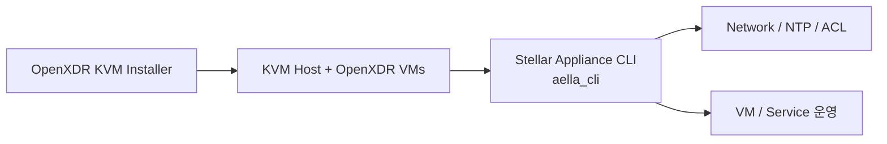

# Stellar Appliance CLI

Stellar Appliance CLI는 OpenXDR KVM Installer로 배포된 KVM Host를 하나의 `aella_cli` 인터페이스에서 운영하기 위한 도구입니다. Installer가 구성한 Network 및 Appliance 구조를 인식하고 주요 Day-2 운영 작업을 통합합니다.

## 주요 관리 기능

- Network Interface, IP, Gateway 및 DNS
- 여러 Linux Time Service를 지원하는 NTP 설정
- Staging 방식의 ACL / Firewall Policy 및 Rule 적용
- Hostname, Timezone, System Information 및 Service 제어
- VM Console과 VM Autostart
- Appliance Monitoring 및 Patch 작업

## 일반적인 관계

현재 Repository는 주로 Linux KVM Host를 대상으로 하며 Python 3.10+와 System 변경 작업을 위한 sudo 권한을 요구합니다.

<CardGroup cols={2}>
  <Card title="OpenXDR KVM Installer" icon="server" href="/ko/products/openxdr-kvm-installer">
    Appliance Host를 준비하는 배포 자동화 도구를 확인합니다.
  </Card>
  <Card title="Source Repository" icon="github" href="https://github.com/xdr-labs/Stellar-appliance-cli">
    Command, 설치, ACL Workflow 및 Troubleshooting 내용을 확인합니다.
  </Card>
</CardGroup>
