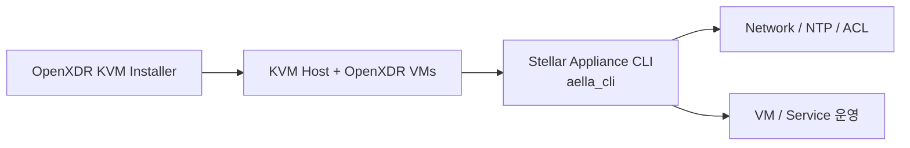

# Stellar Appliance CLI

Stellar Appliance CLI는 OpenXDR KVM Installer로 배포한 KVM 호스트를 `aella_cli` 하나로 운영하기 위한 도구입니다. 설치 도구가 만든 네트워크와 어플라이언스 구성을 인식하고, 설치 이후 자주 필요한 운영 작업을 한곳에서 처리합니다.

## 주요 관리 기능

- 네트워크 인터페이스, IP, 게이트웨이, DNS
- NTPsec 기반 NTP 설정
- 단계적으로 적용하는 ACL / 방화벽 정책과 규칙
- 호스트명, 시간대, 시스템 정보, 서비스 제어
- VM Console과 VM Autostart
- 어플라이언스 모니터링과 패치 작업

## 일반적인 관계

```mermaid
flowchart LR
  I[OpenXDR KVM Installer] --> H[KVM Host + OpenXDR VMs]
  H --> C[Stellar Appliance CLI\naella_cli]
  C --> N[Network / NTP / ACL]
  C --> V[VM / Service 운영]
```

현재 NTP 관리는 **NTPsec만 지원**합니다. Chrony, systemd-timesyncd, 기존 ntp로 자동 전환하지 않습니다.

현재 구현은 주로 Linux KVM 호스트를 대상으로 하며 Python 3.10+와 시스템 변경에 필요한 sudo 권한이 필요합니다.

<CardGroup cols={2}>
  <Card title="OpenXDR KVM Installer" icon="server" href="/ko/products/openxdr-kvm-installer">
    어플라이언스 호스트를 준비하는 배포 자동화 도구를 확인합니다.
  </Card>
  <Card title="Source Repository" icon="github" href="https://github.com/xdr-labs/Stellar-appliance-cli">
    명령어, 설치, ACL 적용 절차와 문제 해결 방법을 확인합니다.
  </Card>
</CardGroup>
