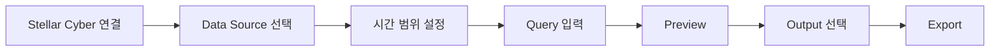

# Stellar Data Exporter

Stellar Data Exporter는 Stellar Cyber Raw Data를 검색하고 결과를 Preview한 뒤 Browser Download, S3-Compatible Object Storage 또는 SFTP로 Export하기 위한 Web UI입니다.

매번 별도의 API Script를 작성하지 않고 여러 Stellar Cyber Data Source에서 반복적으로 데이터를 조회하고 내보내려는 Analyst, Engineer, Administrator에게 적합합니다.

## 주요 기능

- Account Email + All-Access Token을 사용하는 Root Scope 인증
- User API Key를 사용하는 User Scope 인증
- 친숙한 Data Source 다중 선택과 내부 Stellar Cyber Index 자동 매핑
- Start/End Time 지정
- Elasticsearch DSL 및 Stellar Cyber/Lucene Query
- Export 전에 결과 Preview
- CSV, JSON Array, NDJSON 출력
- Browser Download, S3-Compatible Storage, SFTP Destination
- Field 선택, Record Limit, gzip, File Split
- 대용량 Export를 위한 Adaptive Time Slicing
- Progress, Cancel, Sanitized History, 지원 가능한 Retry/Resume
- Secret을 저장하지 않는 Saved Profile 및 Query History/Favorites
- 선택적 Scheduled S3/SFTP Export

## 일반적인 사용 흐름

## 인증 방식

| Mode | 필요한 입력 | Query 동작 |
| --- | --- | --- |
| **Root Scope** | Account Email + All-Access Token | Elasticsearch DSL 또는 Stellar Cyber Query |
| **User Scope** | User API Key | Raw Data Query/Export에 Stellar Cyber Query 자동 선택 |

두 방식 모두 실제 Raw Data 요청 전에 입력된 Credential을 Short-Lived Stellar Cyber Access Token으로 교환합니다.

<Note>
  User Scope API Key도 Raw Data 검색과 Export에 사용할 수 있습니다. Preview 전용이나 Metadata 전용 Mode로 취급하지 않습니다.
</Note>

## Output Destination

<CardGroup cols={3}>
  <Card title="Browser Download" icon="download">
    CSV, JSON, NDJSON을 Browser로 직접 Download합니다. Split된 Browser Export는 ZIP으로 묶을 수 있습니다.
  </Card>
  <Card title="S3-Compatible" icon="cloud">
    AWS S3, Cloudflare R2, MinIO 또는 지원되는 S3-Compatible Endpoint로 전송합니다.
  </Card>
  <Card title="SFTP" icon="arrow-right-arrow-left">
    Password 또는 SSH Private Key 인증으로 SFTP Destination에 전송합니다.
  </Card>
</CardGroup>

## Basic vs Advanced

**Basic Mode**는 Data Source, Time, Query, Output, Destination 중심으로 화면을 단순하게 유지합니다.

**Advanced Mode**에서는 다음과 같은 추가 설정을 사용할 수 있습니다.

- Export Field 선택
- Record Limit
- CSV Delimiter/Header/BOM
- gzip Compression
- 최대 File Size 및 File Split
- Adaptive Slicing 설정
- Overlap Policy
- TLS Verification, S3 Path-Style Addressing, SFTP Host-Key Verification
- Saved Profile, Query History, Export History, Scheduling

## 보안 경계

- 일반 Interactive Export Credential은 Persistent Job History에 기록하지 않습니다.
- Browser Saved Profile에는 Credential과 Destination Secret을 저장하지 않습니다.
- Scheduled Export 설정과 실행에 필요한 Credential은 Encrypted At Rest로 저장합니다.
- TLS Verification은 기본 Enabled입니다.
- 현재 Application은 Multi-User Isolation Layer를 제공하지 않습니다.
- Stellar Cyber **Host** 값에 대한 연결은 사용자의 Browser가 아니라 Exporter Server에서 수행됩니다.
- Development Uvicorn Listener를 Public Internet에 직접 노출하지 마세요.
- Nginx 등의 Reverse Proxy로 외부에 공개할 때는 인증/접근제어를 적용하고 Exporter가 연결할 수 있는 Stellar Cyber Outbound Target도 제한하세요.

Hardened Nginx/systemd 배포는 Source Repository의 Production Runbook을 사용하세요.

<CardGroup cols={2}>
  <Card title="사용 설명서" icon="book-open" href="/ko/products/stellar-data-exporter-guide">
    연결, Query, Preview, Export, Troubleshooting까지 전체 사용 절차를 확인합니다.
  </Card>
  <Card title="Source Repository" icon="github" href="https://github.com/xdr-labs/stellar-data-exporter">
    구현, Test, Production Runbook 및 현재 Release 상태를 확인합니다.
  </Card>
</CardGroup>
