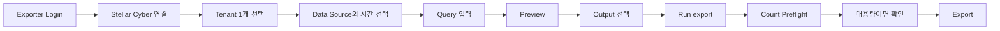

# Stellar Data Exporter

Stellar Data Exporter는 Stellar Cyber Raw Data를 검색하고 결과를 Preview한 뒤 Browser Download, S3-Compatible Object Storage 또는 SFTP로 Export하기 위한 Web UI입니다.

매번 별도의 API Script를 작성하지 않고 여러 Stellar Cyber Data Source에서 반복적으로 데이터를 조회하고 내보내려는 Analyst, Engineer, Administrator에게 적합합니다.

## 지금 바로 사용하기

**Stellar Data Exporter는 데모가 아닙니다.** 아래 Hosted Service는 설치 없이 Browser에서 바로 접속해 실제로 사용할 수 있는 서비스입니다.

- **서비스:** [https://exporter.xdr.ooo](https://exporter.xdr.ooo)
- **Username:** `stellar`
- **Password:** `stellar`

로그인한 뒤 자신의 Stellar Cyber Host와 Root Scope 또는 User Scope API Credential을 입력하고 **Test connection**을 실행한 다음 Tenant 하나를 선택해 Preview부터 시작하면 됩니다.

<Note>
  이 공용 계정은 Exporter 서비스에 접속하기 위한 로그인입니다. Stellar Cyber 데이터를 Query하려면 별도로 자신의 Stellar Cyber API Credential을 Exporter 화면에 입력해야 합니다.
</Note>

## 주요 기능

- Exporter UI/API 접근을 위한 공통 HTTP Basic Login
- Account Email + All-Access Token을 사용하는 Root Scope 인증
- User API Key를 사용하는 User Scope 인증
- Credential로 접근 가능한 Stellar Cyber Tenant 자동 조회 및 단일 Tenant 선택
- 최소 1개가 반드시 유지되는 Data Source 선택, 기본 Alerts 선택 및 내부 Stellar Cyber Index 자동 매핑
- Start/End Time 지정
- Root Scope의 Elasticsearch DSL과 Root/User Scope의 Stellar Cyber/Lucene Query
- Export 전에 결과 Preview
- 실제 Export 시작 전 Count-Only Preflight 및 대용량 Export 명시적 확인
- CSV, JSON Array, NDJSON 출력
- Browser Download, S3-Compatible Storage, SFTP Destination
- Field 선택, Record Limit, gzip, File Split
- 대용량 Export를 위한 Adaptive Time Slicing
- Progress, Cancel, Sanitized History, 지원 가능한 Retry/Resume
- Secret을 저장하지 않는 Saved Profile 및 Query History/Favorites
- 선택적 Scheduled S3/SFTP Export

## 일반적인 사용 흐름

## 인증 방식

| Mode | 필요한 입력 | Query 동작 |
| --- | --- | --- |
| **Root Scope** | Account Email + All-Access Token | Elasticsearch DSL 또는 Stellar Cyber Query |
| **User Scope** | User API Key | Raw Data Query/Export에 Stellar Cyber Query 자동 선택 |

두 방식 모두 실제 Raw Data 요청 전에 입력된 Credential을 Short-Lived Stellar Cyber Access Token으로 교환합니다.

**Test connection**을 실행하면 해당 Credential로 접근 가능한 Tenant 목록을 불러옵니다. Preview나 Export를 실행하기 전에 Tenant를 정확히 하나 선택해야 하며, Backend가 모든 Raw Data Query에 선택 Tenant를 강제로 적용합니다. 따라서 Preview, Count Check, Manual Export, Resume, Schedule이 같은 Tenant 범위 안에서 동작합니다.

<Note>
  User Scope API Key도 **Stellar Cyber Query (Lucene)**를 사용해 Raw Data 검색과 Export를 할 수 있습니다. Elasticsearch DSL은 User Scope에서는 의도적으로 비활성화되며 **Root Scope 전용**입니다. User API Key라도 실제 권한에 따라 여러 Tenant가 보일 수 있으므로 Tenant 선택은 항상 필요합니다.
</Note>

## Output Destination

<CardGroup cols={3}>
  <Card title="Browser Download" icon="download">
    CSV, JSON, NDJSON을 Browser로 직접 Download합니다. Split된 Browser Export는 ZIP으로 묶을 수 있습니다.
  </Card>
  <Card title="S3-Compatible" icon="cloud">
    AWS S3, Cloudflare R2, MinIO 또는 지원되는 S3-Compatible Endpoint로 전송합니다.
  </Card>
  <Card title="SFTP" icon="arrow-right-arrow-left">
    Password 또는 SSH Private Key 인증으로 SFTP Destination에 전송합니다.
  </Card>
</CardGroup>

## Basic vs Advanced

**Basic Mode**는 Data Source, Time, Query, Output, Destination 중심으로 화면을 단순하게 유지합니다.

**Advanced Mode**에서는 다음과 같은 추가 설정을 사용할 수 있습니다.

- Export Field 선택
- Record Limit
- CSV Delimiter/Header/BOM
- gzip Compression
- 최대 File Size 및 File Split
- Adaptive Slicing 설정
- Overlap Policy
- TLS Verification, S3 Path-Style Addressing, SFTP Host-Key Verification
- Saved Profile, Query History, Export History, Scheduling

## 보안 경계

- UI와 API는 HTTP Basic Login으로 보호하며 `/api/health`만 Health Check를 위해 인증 없이 사용할 수 있습니다.
- Hosted Service의 현재 공용 Exporter Login은 `stellar / stellar`입니다.
- Self-Hosted 설치도 같은 기본 Login을 사용하며 필요하면 `STELLAR_EXPORTER_UI_USERNAME`, `STELLAR_EXPORTER_UI_PASSWORD`로 변경할 수 있습니다.
- 직접 실행하는 Self-Hosted 인스턴스는 기본적으로 HTTPS `0.0.0.0:8787`에 Bind하므로 허용된 네트워크에서는 `https://<exporter-host-ip>:8787`로 접속합니다. 필요한 경우 Host Firewall에서 TCP/8787 접근 범위를 제한하세요.
- Stellar Cyber 연결 후 접근 가능한 Tenant 중 하나를 반드시 선택하며 Backend가 Raw Data Query에 해당 Tenant를 강제로 적용합니다.
- 일반 Interactive Export Credential은 Persistent Job History에 기록하지 않습니다.
- Browser Saved Profile에는 Credential과 Destination Secret을 저장하지 않습니다.
- Scheduled Export 설정과 실행에 필요한 Credential은 Encrypted At Rest로 저장합니다.
- TLS Verification은 기본 Enabled입니다.
- 공통 Basic Login은 사용자별 RBAC 또는 Multi-User Isolation Layer가 아닙니다.
- Stellar Cyber **Host** 값에 대한 연결은 사용자의 Browser가 아니라 Exporter Server에서 수행됩니다.
- Development Uvicorn Listener를 Public Internet에 직접 노출하지 마세요.
- Nginx 등의 Reverse Proxy로 외부에 공개할 때는 Application Authentication을 유지하고 Exporter가 연결할 수 있는 Stellar Cyber Outbound Target도 제한하세요.

Hardened Nginx/systemd 배포는 Source Repository의 Production Runbook을 사용하세요.

<CardGroup cols={2}>
  <Card title="사용 설명서" icon="book-open" href="/ko/products/stellar-data-exporter-guide">
    Basic 사용법과 Query Inspector, Field 선택, 대용량 Export, Remote Destination, Schedule, Troubleshooting을 실제 Advanced 시나리오로 따라합니다.
  </Card>
  <Card title="Source Repository" icon="github" href="https://github.com/xdr-labs/stellar-data-exporter">
    구현, Test, Production Runbook 및 현재 Release 상태를 확인합니다.
  </Card>
</CardGroup>
