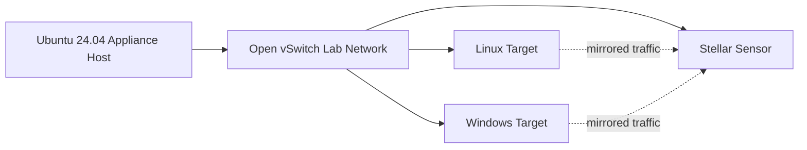

# XDR Lab Appliance

XDR Lab Appliance는 Ubuntu 24.04 Host 한 대를 Self-Contained하고 다시 구축할 수 있는 XDR/NDR Test Environment로 구성합니다. KVM이 VM을 제공하고 Open vSwitch가 Lab Network 및 Traffic Mirroring Plane을 담당합니다.

## Lab 구성 요소

- Mirrored Lab Traffic을 관찰하는 **Stellar Cyber Modular Data Sensor** VM
- Cloud-init으로 배포되는 **Linux Target**
- 준비된 qcow2 Image로 배포되는 **Windows Target**
- 추가 Scenario를 위한 Disposable Linux Test VM
- Operator Access를 위한 Deterministic Reverse-NAT Mapping
- Deployment, Lifecycle, Snapshot, Mirror Validation, NAT Check 및 Scenario 운영을 위한 `aella_cli lab`

## 구조 한눈에 보기

Lab은 Source-Controlled Configuration에서 파괴 후 다시 구축할 수 있도록 설계되어 있어, 한 번 수동으로 만든 Test Network가 아니라 반복 가능한 XDR/NDR Validation과 Engineering 작업에 적합합니다.

## Host 요구사항

문서화된 Architecture는 Ubuntu 24.04, KVM/libvirt 및 Open vSwitch를 사용합니다. Appliance 자체가 VM으로 실행되는 경우 상위 Hypervisor에서 Nested Virtualization을 활성화해야 합니다. Traffic Mirroring과 Nested L2 동작을 위해 Virtual Switch의 관련 Security 설정도 필요합니다.

<Card title="Source Repository" icon="github" href="https://github.com/xdr-labs/xdr-lab-appliance">
  Authoritative Lab Architecture, Deployment Readiness, Runtime Validation 및 Operator Workflow를 확인합니다.
</Card>
