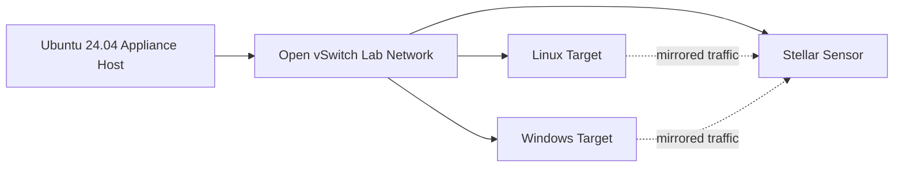

# XDR Lab Appliance

XDR Lab Appliance는 Ubuntu 24.04 호스트 한 대에 다시 구축할 수 있는 독립형 XDR/NDR 테스트 환경을 만듭니다. KVM은 가상머신을 실행하고 Open vSwitch는 랩 네트워크와 트래픽 미러링을 담당합니다.

## Lab 구성 요소

- 미러링된 랩 트래픽을 수집하는 **Stellar Cyber Modular Data Sensor** VM
- Cloud-init으로 배포되는 **Linux 테스트 대상**
- 준비된 qcow2 이미지로 배포되는 **Windows 테스트 대상**
- 추가 시나리오에 사용할 수 있는 일회성 Linux 테스트 VM
- 운영자 접속을 위한 고정 Reverse-NAT 매핑
- 배포, 수명주기, 스냅샷, 트래픽 미러 검증, NAT 점검, 시나리오 실행을 위한 `aella_cli lab`

## 구조 한눈에 보기

```mermaid
flowchart LR
  H[Ubuntu 24.04 Appliance Host]
  O[Open vSwitch Lab Network]
  S[Stellar Sensor]
  L[Linux Target]
  W[Windows Target]
  H --> O
  O --> S
  O --> L
  O --> W
  L -. mirrored traffic .-> S
  W -. mirrored traffic .-> S
```

랩 전체를 버전 관리된 설정에서 다시 만들 수 있으므로, 한 번 수동으로 구성하고 끝나는 테스트 네트워크가 아니라 반복적인 XDR/NDR 검증과 엔지니어링 작업에 적합합니다.

## Host 요구사항

현재 문서의 기본 구성은 Ubuntu 24.04, KVM/libvirt, Open vSwitch를 사용합니다.

- **최소 구성:** 약 4 vCPU / 16 GiB RAM / 200 GiB 디스크
- **4개 VM 동시 운영 권장:** 약 12+ vCPU / 24–32 GiB RAM + 스냅샷을 고려한 여유 디스크 공간

어플라이언스 자체를 VM으로 실행한다면 상위 하이퍼바이저에서 Nested Virtualization을 활성화해야 합니다. 트래픽 미러링과 중첩 L2 통신이 동작하도록 가상 스위치의 관련 보안 설정도 확인해야 합니다.

정확한 용량 산정과 토폴로지 준비 조건은 소스 저장소의 `docs/deployment-readiness.md`를 확인하십시오.

<Card title="Source Repository" icon="github" href="https://github.com/xdr-labs/xdr-lab-appliance">
  랩 아키텍처, 배포 준비 조건, 실행 검증, 운영 절차의 최신 기준을 확인합니다.
</Card>
