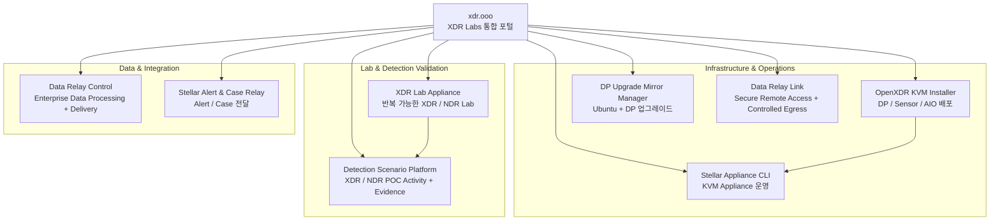

# 프로젝트 관계 및 디렉터리

## 프로젝트 관계 한눈에 보기

이 구조는 **하나로 묶인 거대한 Platform이 아니라 독립적으로 사용할 수 있는 Toolbox**입니다. 화살표는 함께 쓰기 좋은 일반적인 관계를 보여줄 뿐 필수 의존성을 의미하지 않습니다.

<Note>
  Data Relay Link와 Data Relay Control은 의도적으로 별도 Node로 표시합니다. **Link는 Secure Connectivity 제품이고, Control은 Enterprise Data Control 제품입니다.** 현재 Data Relay Control은 Link의 중앙 관리 제품이 아닙니다.
</Note>

## 프로젝트 디렉터리

| 프로젝트 | 주요 목적 | 제품 페이지 | 소스 |
| --- | --- | --- | --- |
| **Data Relay Link** | 제한망/사설망의 Secure Remote Access + Controlled Egress | [link.datarelay.run](https://link.datarelay.run/) | [GitHub](https://github.com/xdr-labs/frp-auto-deploy) |
| **Data Relay Control** | Enterprise Data Flow Processing, Policy/Governance, Multi-Destination Delivery | [control.datarelay.run](https://control.datarelay.run/) | [GitHub](https://github.com/datarelay-labs/gdc-platform) |
| **DP Ubuntu Upgrade Mirror Manager** | DP OS + Phase 2 통제 업그레이드 | [dpos.xdr.ooo](https://dpos.xdr.ooo/) | [GitHub](https://github.com/xdr-labs/ubuntu-mirror-automation) |
| **Detection Scenario Platform** | XDR/NDR POC 검증용 실제 Security Activity / Evidence 생성 | [dsp.xdr.ooo](https://dsp.xdr.ooo/) | [GitHub](https://github.com/xdr-labs/xdr-poc-script) |
| **OpenXDR KVM Installer** | KVM 기반 DP/Sensor/AIO 배포 | [제품 페이지](/ko/products/openxdr-kvm-installer) | [GitHub](https://github.com/xdr-labs/OpenXDR-KVM-Installer) |
| **Stellar Appliance CLI** | KVM Appliance 운영 | [제품 페이지](/ko/products/stellar-appliance-cli) | [GitHub](https://github.com/xdr-labs/Stellar-appliance-cli) |
| **XDR Lab Appliance** | 재구축 가능한 XDR/NDR Lab | [제품 페이지](/ko/products/xdr-lab-appliance) | [GitHub](https://github.com/xdr-labs/xdr-lab-appliance) |
| **Stellar Alert & Case Relay** | Stellar Alert/Case를 기존 SIEM/SOC로 전달 | [stellar-relay.xdr.ooo](https://stellar-relay.xdr.ooo/) | [GitHub](https://github.com/xdr-labs/Stellar-Case-Alert-to-Sylog) |

## 빠른 이동

<CardGroup cols={2}>
  <Card title="프로젝트 소개" icon="grid-2" href="/ko/projects">
    각 프로젝트의 역할과 범위를 확인합니다.
  </Card>

  <Card title="문제별 프로젝트 찾기" icon="compass" href="/ko/choose-project">
    해결하려는 문제를 기준으로 바로 적합한 프로젝트를 선택합니다.
  </Card>
</CardGroup>
