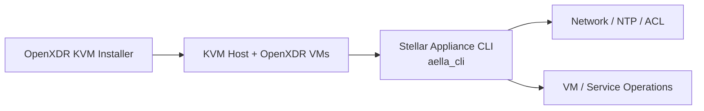

# Stellar Appliance CLI

Stellar Appliance CLI provides a single `aella_cli` interface for operating KVM hosts deployed with the OpenXDR KVM Installer. It recognizes the networking and appliance conventions created by the installer and centralizes common day-2 operations.

## What it manages

- network interfaces, IP addressing, gateway, and DNS
- NTP configuration through the NTPsec backend
- staged ACL / firewall policy and rule application
- hostname, timezone, system information, and service control
- VM console access and VM autostart
- appliance monitoring and patch operations

## Typical relationship

The current implementation supports **NTPsec only** for NTP management; it does not automatically switch to chrony, systemd-timesyncd, or legacy ntp.

The CLI is primarily intended for Linux KVM hosts. The current repository documents Python 3.10+ and sudo privileges for system-changing operations.

<CardGroup cols={2}>
  <Card title="OpenXDR KVM Installer" icon="server" href="/products/openxdr-kvm-installer">
    See the deployment tooling that prepares the appliance host.
  </Card>
  <Card title="Source repository" icon="github" href="https://github.com/xdr-labs/Stellar-appliance-cli">
    Review commands, installation steps, ACL workflow, and troubleshooting details.
  </Card>
</CardGroup>
