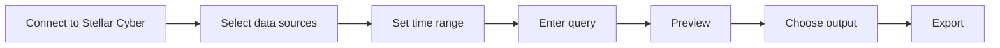

# Stellar Data Exporter

Stellar Data Exporter is a Web UI for querying Stellar Cyber raw data, previewing the result, and exporting it to browser download, S3-compatible object storage, or SFTP.

It is useful when an analyst or engineer needs repeatable exports across multiple Stellar Cyber data sources without building a new API script for every request.

## What it provides

- Root Scope authentication with account email + All-Access Token
- User Scope authentication with a User API Key
- friendly multi-select data sources mapped internally to Stellar Cyber indices
- explicit start/end time selection
- Elasticsearch DSL and Stellar Cyber/Lucene query modes
- query preview before export
- CSV, JSON Array, and NDJSON output
- browser download, S3-compatible storage, and SFTP destinations
- field selection, record limits, gzip, and file splitting
- adaptive time slicing for large export windows
- progress, cancellation, persistent sanitized history, and supported retry/resume
- saved non-secret profiles and query history/favorites
- optional scheduled S3/SFTP exports

## Normal workflow

## Credential modes

| Mode | Required input | Query behavior |
| --- | --- | --- |
| **Root Scope** | Account email + All-Access Token | Elasticsearch DSL or Stellar Cyber Query |
| **User Scope** | User API Key | Stellar Cyber Query is selected for raw-data query/export |

Both credential types are exchanged for a short-lived Stellar Cyber access token before raw-data requests are sent.

<Note>
  User Scope API Key mode supports raw-data search and export. It is not treated as a preview-only or metadata-only mode.
</Note>

## Output destinations

<CardGroup cols={3}>
  <Card title="Browser download" icon="download">
    Export CSV, JSON, or NDJSON directly to the browser. Split browser exports can be delivered as a ZIP.
  </Card>
  <Card title="S3-compatible" icon="cloud">
    Send output to AWS S3, Cloudflare R2, MinIO, or another supported S3-compatible endpoint.
  </Card>
  <Card title="SFTP" icon="arrow-right-arrow-left">
    Send output over SFTP with password or SSH private-key authentication.
  </Card>
</CardGroup>

## Basic vs Advanced

**Basic mode** keeps the normal workflow focused on data sources, time, query, output, and destination.

**Advanced mode** exposes additional controls such as:

- selected export fields
- record limit
- CSV delimiter/header/BOM behavior
- gzip compression
- maximum file size and split files
- adaptive slicing controls
- overlap policy
- remote destination details
- saved profiles, query history, export history, and scheduling controls

## Security boundary

- interactive credentials are not written into persistent job history
- browser-saved profiles exclude credentials and destination secrets
- TLS verification is enabled by default
- the current application does not provide a multi-user isolation layer
- the development Uvicorn listener should not be exposed directly to the public Internet

For hardened Nginx/systemd deployment guidance, use the production runbook in the source repository.

<CardGroup cols={2}>
  <Card title="User Guide" icon="book-open" href="/products/stellar-data-exporter-guide">
    Follow the complete connection, query, preview, export, and troubleshooting workflow.
  </Card>
  <Card title="Source Repository" icon="github" href="https://github.com/xdr-labs/stellar-data-exporter">
    Review the implementation, tests, production runbook, and current release state.
  </Card>
</CardGroup>
