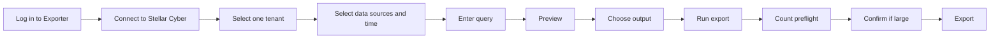

# Stellar Data Exporter

Stellar Data Exporter is a Web UI for querying Stellar Cyber raw data, previewing the result, and exporting it to browser download, S3-compatible object storage, or SFTP.

It is useful when an analyst or engineer needs repeatable exports across multiple Stellar Cyber data sources without building a new API script for every request.

## Use the live service now

**Stellar Data Exporter is not a demo.** The hosted service below is a live, ready-to-use service that you can open and use immediately without installing the exporter locally.

- **Service:** [https://exporter.xdr.ooo](https://exporter.xdr.ooo)
- **Username:** `stellar`
- **Password:** `stellar`

After signing in, enter your own Stellar Cyber Host and Root Scope or User Scope API credential, run **Test connection**, select one Tenant, and start with Preview.

<Note>
  The shared Exporter account authenticates access to the Exporter service. It is separate from your Stellar Cyber API credential, which you still provide inside the Exporter for querying your own Stellar Cyber data.
</Note>

## What it provides

- shared HTTP Basic login for access to the exporter UI/API
- Root Scope authentication with account email + All-Access Token
- User Scope authentication with a User API Key
- automatic discovery of accessible Stellar Cyber tenants and required single-tenant selection
- friendly multi-select data sources mapped internally to Stellar Cyber indices
- explicit start/end time selection
- Elasticsearch DSL and Stellar Cyber/Lucene query modes
- query preview before export
- count-only export preflight with explicit confirmation for large matches
- CSV, JSON Array, and NDJSON output
- browser download, S3-compatible storage, and SFTP destinations
- field selection, record limits, gzip, and file splitting
- adaptive time slicing for large export windows
- progress, cancellation, persistent sanitized history, and supported retry/resume
- saved non-secret profiles and query history/favorites
- optional scheduled S3/SFTP exports

## Normal workflow

## Credential modes

| Mode | Required input | Query behavior |
| --- | --- | --- |
| **Root Scope** | Account email + All-Access Token | Elasticsearch DSL or Stellar Cyber Query |
| **User Scope** | User API Key | Stellar Cyber Query is selected for raw-data query/export |

Both credential types are exchanged for a short-lived Stellar Cyber access token before raw-data requests are sent.

After **Test connection**, the exporter loads the tenants visible to that credential. Select exactly one tenant before Preview or Export. The backend injects the selected tenant into every raw-data query, so Preview, count checks, manual exports, resume, and schedules stay within that tenant.

<Note>
  User Scope API Key mode supports raw-data search and export. It is not treated as a preview-only or metadata-only mode. A User API Key can still expose multiple tenants depending on its effective Stellar Cyber permissions, so tenant selection is always required.
</Note>

## Output destinations

<CardGroup cols={3}>
  <Card title="Browser download" icon="download">
    Export CSV, JSON, or NDJSON directly to the browser. Split browser exports can be delivered as a ZIP.
  </Card>
  <Card title="S3-compatible" icon="cloud">
    Send output to AWS S3, Cloudflare R2, MinIO, or another supported S3-compatible endpoint.
  </Card>
  <Card title="SFTP" icon="arrow-right-arrow-left">
    Send output over SFTP with password or SSH private-key authentication.
  </Card>
</CardGroup>

## Basic vs Advanced

**Basic mode** keeps the normal workflow focused on data sources, time, query, output, and destination.

**Advanced mode** exposes additional controls such as:

- selected export fields
- record limit
- CSV delimiter/header/BOM behavior
- gzip compression
- maximum file size and split files
- adaptive slicing controls
- overlap policy
- TLS verification, S3 path-style addressing, and SFTP host-key verification
- saved profiles, query history, export history, and scheduling controls

## Security boundary

- the UI and API require HTTP Basic authentication; `/api/health` remains available for health checks
- the hosted service currently uses the shared Exporter login `stellar / stellar`
- self-hosted installs use the same default login and can override it with `STELLAR_EXPORTER_UI_USERNAME` and `STELLAR_EXPORTER_UI_PASSWORD`
- after connection, exactly one accessible Stellar Cyber tenant must be selected and the backend enforces that tenant on raw-data queries
- interactive credentials are not written into persistent job history
- browser-saved profiles exclude credentials and destination secrets
- scheduled export configurations, including required credentials, are encrypted at rest
- TLS verification is enabled by default
- the shared Basic Auth gate is not a per-user authorization or multi-user isolation layer
- the Stellar Cyber **Host** value is reached from the exporter server, not from the user's browser
- the development Uvicorn listener should not be exposed directly to the public Internet
- if Nginx or another reverse proxy publishes the exporter, keep authentication enabled and restrict the outbound Stellar Cyber targets the exporter is allowed to reach

For hardened Nginx/systemd deployment guidance, use the production runbook in the source repository.

<CardGroup cols={2}>
  <Card title="User Guide" icon="book-open" href="/products/stellar-data-exporter-guide">
    Follow Basic workflows and Advanced scenario guides for Query Inspector, field selection, large exports, remote destinations, schedules, and troubleshooting.
  </Card>
  <Card title="Source Repository" icon="github" href="https://github.com/xdr-labs/stellar-data-exporter">
    Review the implementation, tests, production runbook, and current release state.
  </Card>
</CardGroup>
