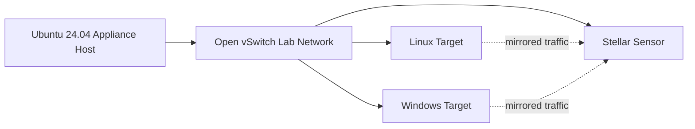

# XDR Lab Appliance

XDR Lab Appliance turns one Ubuntu 24.04 host into a self-contained, rebuildable XDR/NDR test environment. KVM provides the virtual machines and Open vSwitch provides the lab network and traffic-mirroring plane.

## Lab components

- **Stellar Cyber Modular Data Sensor** VM for observing mirrored lab traffic
- **Linux target** provisioned with cloud-init
- **Windows target** deployed from a prepared qcow2 image
- optional disposable Linux test VM for additional scenarios
- deterministic reverse-NAT mappings for operator access
- `aella_cli lab` commands for deployment, lifecycle, snapshots, mirror validation, NAT checks, and scenario operations

## Architecture at a glance

The lab is designed to be destroyed and rebuilt from source-controlled configuration, making it suitable for repeatable XDR/NDR validation and engineering work rather than a one-off manually assembled test network.

## Host requirements

The documented architecture uses Ubuntu 24.04 with KVM/libvirt and Open vSwitch. When the appliance itself runs as a VM, nested virtualization must be exposed by the outer hypervisor. Traffic mirroring and nested L2 operation also require appropriate virtual-switch security settings.

<Card title="Source repository" icon="github" href="https://github.com/xdr-labs/xdr-lab-appliance">
  Review the authoritative lab architecture, deployment-readiness documents, runtime validation, and operator workflows.
</Card>
