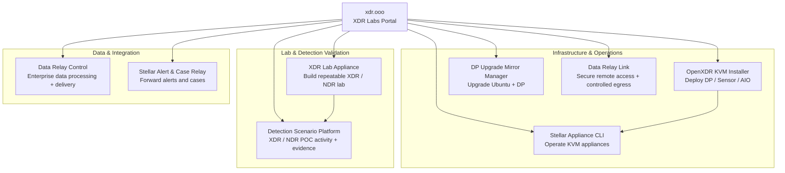

# Project Relationships & Directory

## How the projects fit together

This is a **toolbox, not a single bundled platform**. Projects can be used independently. The arrows show common operational relationships, not mandatory dependencies.

<Note>
  Data Relay Link and Data Relay Control intentionally appear as separate nodes. **Link is a secure-connectivity product; Control is an enterprise data-control product.** The current Data Relay Control implementation is not a centralized manager for Link.
</Note>

## Project directory

| Project | Primary purpose | Product page | Source |
| --- | --- | --- | --- |
| **Data Relay Link** | Secure Remote Access + controlled outbound egress for isolated/restricted networks | [link.datarelay.run](https://link.datarelay.run/) | [GitHub](https://github.com/datarelay-labs/data-relay-link) |
| **Data Relay Control** | Enterprise data-flow processing, policy/governance, and multi-destination delivery | [control.datarelay.run](https://control.datarelay.run/) | [GitHub](https://github.com/datarelay-labs/gdc-platform) |
| **DP Ubuntu Upgrade Mirror Manager** | Controlled DP OS + Phase 2 upgrade workflow | [dpos.xdr.ooo](https://dpos.xdr.ooo/) | [GitHub](https://github.com/xdr-labs/ubuntu-mirror-automation) |
| **Detection Scenario Platform** | Realistic security activity and evidence for XDR/NDR POC validation | [dsp.xdr.ooo](https://dsp.xdr.ooo/) | [GitHub](https://github.com/xdr-labs/xdr-poc-script) |
| **OpenXDR KVM Installer** | DP/Sensor/AIO deployment on KVM | [Product page](/products/openxdr-kvm-installer) | [GitHub](https://github.com/xdr-labs/OpenXDR-KVM-Installer) |
| **Stellar Appliance CLI** | KVM appliance operations | [Product page](/products/stellar-appliance-cli) | [GitHub](https://github.com/xdr-labs/Stellar-appliance-cli) |
| **XDR Lab Appliance** | Rebuildable XDR/NDR lab | [Product page](/products/xdr-lab-appliance) | [GitHub](https://github.com/xdr-labs/xdr-lab-appliance) |
| **Stellar Alert & Case Relay** | Stellar Alert/Case forwarding into existing SIEM/SOC workflows | [stellar-relay.xdr.ooo](https://stellar-relay.xdr.ooo/) | [GitHub](https://github.com/xdr-labs/Stellar-Case-Alert-to-Sylog) |

## Quick navigation

<CardGroup cols={2}>
  <Card title="Projects" icon="grid-2" href="/projects">
    Review each project's role and scope.
  </Card>

  <Card title="Choose by problem" icon="compass" href="/choose-project">
    Select the right project based on the problem you need to solve.
  </Card>
</CardGroup>
