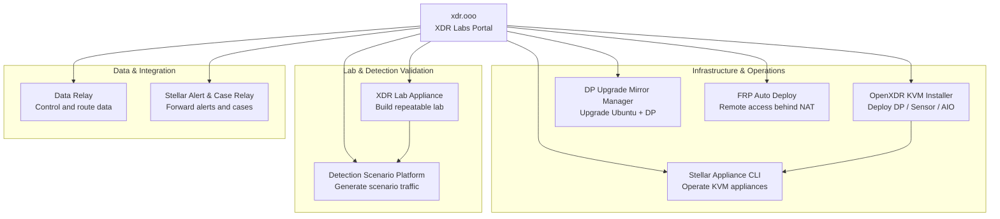

# Project Relationships & Directory

## How the projects fit together

This is a **toolbox, not a single bundled platform**. Projects can be used independently. The arrows only show common operational relationships and do not represent mandatory dependencies.

## Project directory

| Project | Primary purpose | Documentation | Source |
| --- | --- | --- | --- |
| **FRP Auto Deploy** | Zero-Touch remote access behind NAT/firewalls | [frp.xdr.ooo](https://frp.xdr.ooo) | [GitHub](https://github.com/datarelay-labs/frp-auto-deploy) |
| **DP Ubuntu Upgrade Mirror Manager** | Controlled DP OS + Phase 2 upgrade workflow | [dpos.xdr.ooo](https://dpos.xdr.ooo/) | [GitHub](https://github.com/xdr-labs/ubuntu-mirror-automation) |
| **Data Relay** | Enterprise data control and multi-destination delivery | Project docs in repository | [GitHub](https://github.com/datarelay-labs/gdc-platform) |
| **Detection Scenario Platform** | Realistic security-scenario traffic and evidence generation | Project docs in repository | [GitHub](https://github.com/xdr-labs/xdr-poc-script) |
| **OpenXDR KVM Installer** | DP/Sensor/AIO deployment on KVM | Repository README | [GitHub](https://github.com/xdr-labs/OpenXDR-KVM-Installer) |
| **Stellar Appliance CLI** | KVM appliance operations | Repository README | [GitHub](https://github.com/xdr-labs/Stellar-appliance-cli) |
| **XDR Lab Appliance** | Rebuildable XDR/NDR lab | Repository docs | [GitHub](https://github.com/xdr-labs/xdr-lab-appliance) |
| **Stellar Alert & Case Relay** | Stellar alert/case forwarding into existing SIEM/SOC workflows | [stellar-relay.xdr.ooo](https://stellar-relay.xdr.ooo) | [GitHub](https://github.com/xdr-labs/Stellar-Case-Alert-to-Sylog) |

## Quick navigation

<CardGroup cols={2}>
  <Card title="Projects" icon="grid-2" href="/projects">
    Review each project's role and scope.
  </Card>

  <Card title="Choose by problem" icon="compass" href="/choose-project">
    Select the right project based on the problem you need to solve.
  </Card>
</CardGroup>
